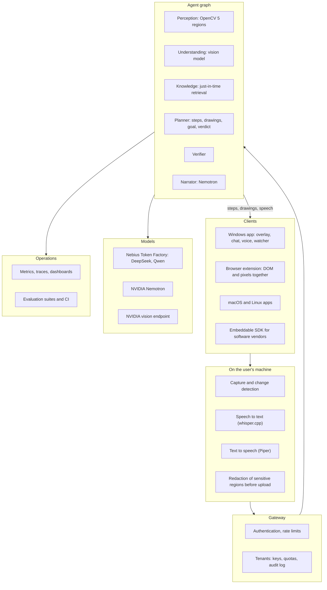
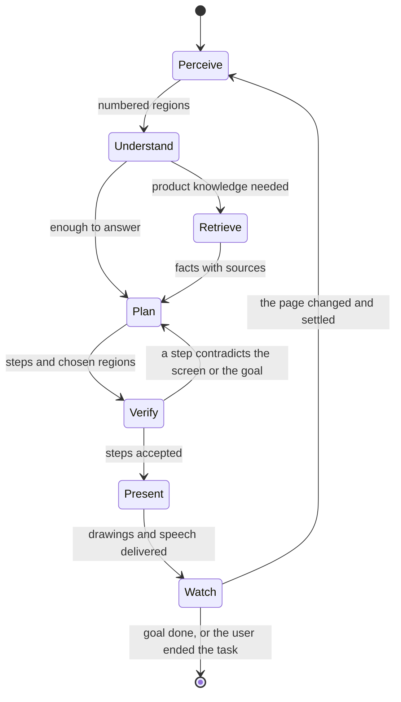

# Sherpa: design

Sherpa is an agent that **sees the screen the way the user sees it, knows what the user is trying to do, and shows them how**. It draws on the screen (arrows, highlights, diagrams, a proof that moves), speaks, and follows the task from page to page without being asked again.

This is the design of the system. The repository holds the implementation as it grows; measured results live next to the code (`backend/evaluation/`), not here, so this document does not go stale with every run.

---

## 1. Product

People get lost in software: a cloud console with hundreds of services, an enterprise tool, a design application, a form with a dozen steps, a lecture video whose proof they cannot follow. The usual remedy is a screenshot pasted into a chatbot, a paragraph back, a click, and the same again at the next page. The chatbot never sees the page the user is on now, and its answer never points at anything.

Sherpa is built on three ideas:

1. **It shares the screen.** The context is what the user sees, now, not a description of it.
2. **It points.** An answer is a place on the screen (a box, an arrow, a highlighted line) with a short reason, not a paragraph.
3. **It follows.** It keeps the goal, notices when the page changes, removes marks that no longer apply and gives the next step without being asked.

One engine serves several uses:

| Use | What the user gets |
|---|---|
| Learning | A proof, a diagram or an idea explained on top of the video or document that shows it, step by step, with animation |
| Software onboarding | A newcomer led through a console or an internal tool one action at a time, only pointing at what is on screen |
| Customer support | A customer shares their own screen with a support agent or bot, which guides them to the fix |
| Training and compliance | An expert's walkthrough recorded once and replayed as a guided path with checks at each page |
| Accessibility | A dense page described and pointed at for people who cannot parse it easily |
| Agents that use computers | Other agents call Sherpa as the tool that answers "where is it" and "is this the right page" |

## 2. System

The **client** keeps the conversation, the goal, the drawings and the regions of the last capture, and sends them with each turn, so the **backend is stateless** and scales horizontally. Speech recognition and synthesis run on the user's computer: no audio leaves it.

## 3. The agent graph

A turn is a small graph of specialised nodes with explicit state, not one prompt. Each node has a typed input and output, is tested by itself and can be replaced.

| Node | Responsibility |
|---|---|
| Perceive | Turns pixels into numbered regions with kinds and boxes (text lines, figures, line segments, controls, labels, images, free space) |
| Understand | The vision model reads the picture and the regions; it names regions by number and never invents coordinates |
| Retrieve | Decides what the screen does not say and fetches it (section 5) |
| Plan | Writes the steps, the drawings, suggested replies, the task's goal and a verdict on the learner's progress: continue, off track, waiting or done |
| Verify | Checks each step before it is shown: the region exists and is the one meant, the caption agrees with the goal and with the previous step, no number or claim is invented |
| Present | Streams steps as they are written; places captions and arrows clear of text; animates drawings; the narrator rewrites each step as natural speech without adding a fact |
| Watch | Compares the live screen with the screen the marks were drawn for; clears stale marks at once; starts the next turn when the page has settled |

### 3.1 Specialised planners

A router picks the planner by the kind of task:

- **Teacher**: proofs, diagrams, animated constructions, with visual aids (such as the Pythagorean proof with moving triangles) as tools the planner can call by name.
- **Guide**: software tasks, one action per step, only pointing at what is on screen, with warnings where a step is irreversible or shows a secret once.
- **Coach**: a longer plan with checkpoints, for tasks that span many pages or sessions.

They share perception, retrieval, the verifier and the watcher.

### 3.2 State

The task state is small and explicit: the goal in one sentence, the verdict of the last turn, how many turns went off track in a row, how many automatic turns have run, the drawings that persist and the regions of the last capture. Following pauses by itself after repeated off-track turns, a cap on automatic turns, or a period of inactivity, and the user can always end the task.

## 4. Tools and protocols

- **Model Context Protocol server.** Sherpa exposes `explain_screen`, `locate_control`, `is_this_the_right_page` and `follow_task` as MCP tools, so coding agents and browser agents can use it as their eyes and pointer. It is a thin adapter over the same backend.
- **Retrieval tools.** Search, extract, map and crawl (Tavily), called by the planner when it decides it needs facts.
- **Visual aids.** Named drawing tools the planner can call (a proof, a bar model, a number line), each producing exact geometry, so the model does not draw by guessing coordinates.
- **Action tools.** An opt-in "do it for me" mode for reversible actions, with per-action approval and an audit trail. By default the tutor points and never clicks.

## 5. Knowledge: retrieval at task time

A fixed index of documentation goes stale the day a console changes its layout. Knowledge is fetched when it is needed:

1. The planner reads the screen and the goal and decides what it does not know ("what does this permission set allow").
2. It calls search and extract with a query made from the screen's own words and the product's name and version where it can tell.
3. Results are ranked against the screen and cited in the answer.
4. They are kept in a cache keyed by product and interface version, with an expiry. The cache grows from use; a page that changed simply misses it and is fetched again.
5. A grounding check compares any step that cites a fact with the fetched page before the step is shown.

## 6. Evaluation

Evaluation is the quality gate, in layers:

| Layer | What it measures |
|---|---|
| Region proposer | Do the regions cover what is on screen: sides of a triangle, small drawings, labels, free space |
| Region pick | One picture and one question: does a drawn mark sit on the right region, across several models |
| Task completion | A multi-screen task driven the way the app drives it, scored on where each turn points and on its verdict |
| Narration faithfulness | A rewrite keeps every number and adds nothing |
| Real sites | Public consoles and calculators with a script of expected controls |
| Regression | Every change runs the suites in CI; a model change is a pull request with a score |
| Human review | A sampled set of turns is rated by people |

Costs and latency per turn are tracked next to accuracy, because a better answer that is twice as slow is a trade-off to choose, not a win.

## 7. Computer vision

OpenCV 5 is why the model's answer lands on a real element:

- **Regions**: text lines (merged into blocks only when tightly stacked, so one menu item can be pointed at), figures, controls, labels, pictures, free space and small marks, as numbered regions with pixel boxes.
- **Drawings**: line segments by Hough transform, closed-shape tracing that tolerates JPEG breaks, so a side of a triangle is a region with end points.
- **Text in regions**: text detection and recognition through the OpenCV DNN module, so the model also gets what each control says.
- **Icons**: template and feature matching (ORB, SIFT) against a library of known product icons.
- **Re-anchoring**: feature matching and a homography between captures, so drawings follow a scroll or a layout shift.
- **Change detection**: a low-resolution stream with averaged frames, block statistics, a mask for areas that always move and the pointer left out; dense optical flow and a small classifier to tell "a page loaded" from "a spinner moved".
- **Controls on any interface**: a detector trained on interface screenshots, run through the DNN module.

## 8. Models

- **Vision turn** on Nebius Token Factory: a primary model with a second model asked when the first has not produced a step in a few seconds (hedged requests), the faster answer winning.
- **Routing**: easy turns to a small fast model, hard ones to a larger one, chosen by the number of regions, the age of the task and the last verdict.
- **Narration** on an NVIDIA Nemotron model with reasoning off, guarded so that a rewrite that loses a number or runs on is dropped and the caption is read.
- **NVIDIA vision** on a dedicated endpoint, compared with the others on the same suites.
- **Batch inference** for the evaluation suites and for replaying recorded sessions against a new model.
- **Fine-tuning** of a small model on accepted turns (choosing regions, writing steps) to cut cost and latency.

## 9. Deployment and scale

- The backend is a container on AWS Lambda on Graviton with a streaming Function URL, defined in CDK; sustained load moves to containers (ECS on Graviton) behind a gateway, Lambda keeps the bursts.
- Tenants have their own keys, quotas, model and retention policy, and an audit log.
- Caches: regions by image hash, retrieval results by product and version.
- Metrics per turn (latency, model latency, regions, attempts, failures, cost) in dashboards and alarms; budgets per tenant.
- Deployed close to the user, because the capture is the heavy part of a request.
- Customers who need the model inside their own account use Bedrock or a self-hosted endpoint.
- Nothing about a turn is stored: no screenshot, no question, no answer.

## 10. Privacy and safety

- The overlay and chat are hidden from screen captures, so the model never sees its own drawings (a recording mode lifts this for demos).
- Speech stays on the device.
- Password fields and detected secrets are redacted on the device before upload.
- An allow-list of applications, and a visible indicator when the tutor is looking.
- Enterprise deployments keep the model endpoint in the customer's cloud account.
- Logs hold timings and errors, never images, tokens or text.

## 11. Technology in depth

| Technology | Role |
|---|---|
| OpenCV 5 | Perception: regions, lines, text, icons, re-anchoring, change detection (section 7) |
| Nebius Token Factory | Vision turns, hedged second model, batch evaluation, fine-tuning, routing, dedicated endpoints |
| NVIDIA Nemotron | Narration now; verification of steps against the region list and the goal; an NVIDIA vision model on a dedicated endpoint |
| Tavily | Search on demand, extract of the exact documentation page, crawl into the cache, grounding checks, "what changed" lookups |
| AWS | Lambda and ECS on Graviton, CloudWatch, S3 and DynamoDB for tenants, cache and evaluation history, Bedrock for customer-hosted models |
| Electron, whisper.cpp, Piper | The desktop client and the on-device voice |
