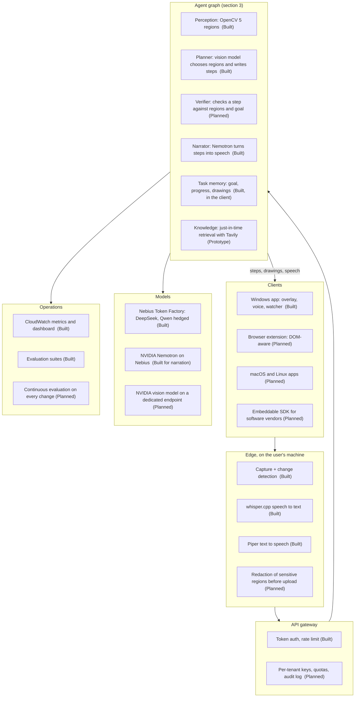
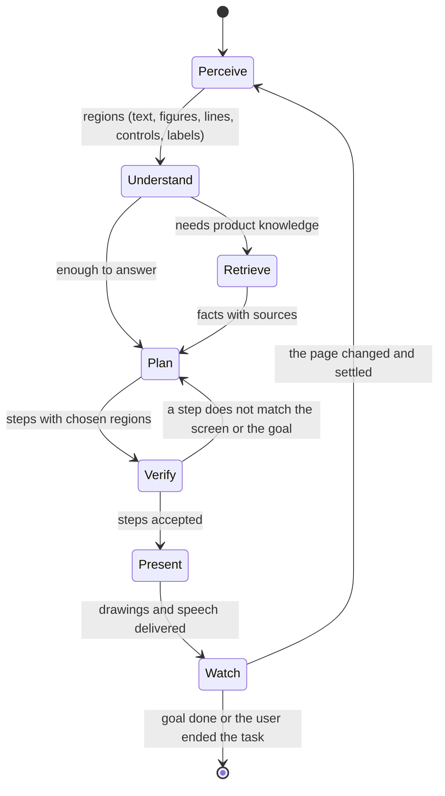

# screen-tutor: from prototype to a product

screen-tutor is an agent that **sees the screen the way the user sees it, knows what the user is trying to do, and shows them how**: it draws on the screen (arrows, highlights, diagrams, a proof that moves), speaks, and follows the task from page to page without being asked again.

What exists today is a **working MVP** (one Windows app, one stateless cloud backend, three hackathon-sized evaluations). This document is the design of the product it is meant to become, and says for each part whether it is **Built**, a **Prototype** or **Planned**. Nothing marked Planned is in the code.

| Status | Meaning |
|---|---|
| **Built** | In the repository, runs, and is covered by a test or a measurement |
| **Prototype** | In the repository, works on the happy path, not hardened or measured |
| **Planned** | A design with an interface and an order of work; not written |

---

## 1. The problem and the bigger picture

People get lost in software: a cloud console with 200 services, an ERP, a design tool, a bank's forms, a lecture video whose proof they cannot follow. Today they take a screenshot, paste it into a chatbot, read a paragraph, go back, click, get lost again. The chatbot never sees the page they are on now, and the answer never points at anything.

The bet: **a guide that shares the screen** (it sees what you see, now), **points** (so the answer is a place on the screen, not a paragraph), and **follows** (so it is there at the next page). The same engine serves:

- **Learning**: a proof or a diagram explained on top of the video that shows it (Built).
- **Software onboarding and support**: lead a newcomer through a console or an internal tool, one click at a time (Built for guided tasks on pages the model can read; Prototype on real consoles).
- **Customer support**: a support agent or a bot hands a customer a link; the customer's own screen is the shared context (Planned).
- **Training and compliance**: record an expert's walkthrough once, replay it as a guided path with checks (Planned).
- **Accessibility**: describe and point for people who cannot easily parse a dense page (Planned).
- **Agents that use computers**: other agents (a coding agent, a browser agent) call screen-tutor as the "where is it and is this the right page" tool (Planned, through MCP, section 4).

## 2. System overview (target)

## 3. The agent graph

A turn is a small graph of specialised steps with explicit state, not one prompt. Today the steps exist as functions in one service; the target makes each one an independently testable and replaceable node.

| Node | Today | Notes |
|---|---|---|
| Perceive | **Built** | OpenCV 5: text lines, figures, line segments (Hough), controls, labels, closed shapes, images, free space, small marks; numbered regions with pixel boxes |
| Understand | **Built** | The vision model reads the picture and the numbered regions; it names regions by number, never by coordinates |
| Retrieve | **Prototype** | The model can ask for a web lookup (Tavily) and cites the sources |
| Plan | **Built** | Steps, drawings, follow-ups, the task's goal and a verdict (continue, off track, waiting, done) |
| Verify | **Planned** | Section 3.2 |
| Present | **Built** | Streamed steps; a planner places captions and arrows clear of text; a driver animates; a narrator rewrites each step as speech |
| Watch | **Built** | Screen change detector with a settle time; clears marks at once; starts the next turn by itself |

### 3.1 Why a graph and not a loop in the client

The client keeps the conversation, the goal and the drawings and sends them with each turn, so the backend is stateless and scales horizontally (Built). The graph is what runs inside a turn. Making it explicit lets us put a retry, a second opinion or a human approval on a single edge, and measure each node by itself.

### 3.2 Verifier (Planned)

A second model checks each planned step before it is shown: does the region it points at exist, does the text of the caption agree with the goal, does it contradict the previous step. A text-only model such as Nemotron can check the caption against the region list and the goal; a vision verifier can check the picture. Success metric: the share of wrong steps stopped before they reach the user, measured on the evaluation suites. We deliberately do not claim this today.

### 3.3 Multiple agents (Planned)

The target splits the planner by task type behind a router: a **teacher** (proofs, diagrams, step animations), a **guide** (software tasks, one action per step, only pointing at what is on screen), and a **coach** (a longer plan with checkpoints). They share perception and the verifier. Today a single prompt carries both the teaching and the guiding rules.

## 4. Tools and protocols

- **Tavily (Prototype)**: the model asks for a lookup when the screen is not enough; the answer cites the sources.
- **MCP server (Planned)**: expose `explain_screen`, `locate_control`, `is_this_the_right_page` and `follow_task` as Model Context Protocol tools, so coding and browser agents can use screen-tutor as their eyes and pointer. The same backend, a thin adapter.
- **Action tools (Planned, off by default)**: today the tutor only points; it never clicks. The design adds an opt-in "do it for me" mode for reversible actions, with per-action approval and an audit trail.

## 5. Knowledge: dynamic retrieval, not a pre-built index

A fixed index of documentation goes stale the day a console changes its layout. The target is **retrieval at task time**:

1. The planner reads the screen and the goal and decides what it does not know ("what does this permission set allow").
2. It calls search and extract tools (Tavily) with a query built from the screen's own words and the product's name and version if it can tell.
3. Results are ranked against the screen, cited in the answer, and kept in a cache keyed by product and interface version, with an expiry.
4. The cache grows from use; nobody builds it in advance, and a page that changed simply misses the cache and is fetched again.

Status: step 1 and 2 are a **Prototype** (one lookup per turn, on the model's request, with sources shown); the cache and ranking are **Planned**.

## 6. Evaluation

Evaluation is the product's quality gate, in layers.

| Layer | What it measures | Status |
|---|---|---|
| Region proposer | Do the regions cover what is on screen; sides of a triangle, small drawings, labels | **Built** (unit tests on synthetic and real-like frames) |
| Region pick | One picture, one question: does a drawn mark sit on the right region (31 cases, six models compared) | **Built** |
| Task completion | A multi-screen task driven the way the app drives it, scored on pointing and on the verdict (`backend/evaluation/tasks_report.md`) | **Built** (3 tasks on one mock console, 9 of 9 for two models; a vaguely worded first run completed 3 of 9) |
| Narration faithfulness | A rewrite must keep every number and add nothing | **Built** (a guard on every rewrite; 7 of 9 accepted on live captions) |
| Real sites | Public consoles and calculators with a script of expected controls | **Planned** |
| Regression in CI | Every change runs the suites; a model change is a pull request with a score | **Planned** |
| Human review | A sampled set of turns is rated by people | **Planned** |

## 7. Computer vision

OpenCV 5 is the reason the model's answer lands on a real element. The model never invents coordinates; it picks from numbered regions found in the pixels:

- text lines, merged into blocks only when tightly stacked, so a menu item or a list row can be pointed at (**Built**);
- figures and drawings, including thin black lines on a white board, found by structure and by closed-shape tracing that tolerates JPEG breaks (**Built**);
- line segments by a Hough transform, so a side of a triangle is a region with end points (**Built**);
- images such as a presenter's face, and free space, so a diagram is placed on flat background and not over a person (**Built**);
- small unnamed marks (a handwritten digit), so a caption keeps off the thing it labels (**Built**);
- screen change detection on a low resolution stream: averaged frames, blocks, a mask for areas that always move, the pointer left out (**Built**).

Planned: UI element detection trained on interface screenshots to replace the heuristics for controls; optical character recognition on regions so the model also gets their text; a learned change detector that tells "a page loaded" from "a spinner moved".

## 8. Models

- **Nebius Token Factory (Built)**: DeepSeek-V4.1-Flash is the default and Qwen3.8-27B the second model; if the first has not produced a step in 4 seconds the same request goes to the second and the first answer wins (hedged requests). Six models were compared on the same 31 cases.
- **NVIDIA Nemotron-3-Super (Built, for speech)**: rewrites each step's caption as natural speech in about 0.7 s with reasoning off, and is never allowed to add a fact; a guard drops a rewrite that loses a number or runs on.
- **NVIDIA vision model on a dedicated endpoint (Planned)**: the vision turn on an NVIDIA model, compared with the current ones on the same suites.
- **Routing (Planned)**: easy turns to a small fast model, hard ones to a larger one, chosen by the number of regions, the task's age and the last verdict.

## 9. Deployment and scale

**Built**: the backend is a container on AWS Lambda on Graviton (arm64) with a streaming Function URL, a bearer token, a per-caller rate limit and CloudWatch metrics. A benchmark against x86 found Graviton about 22 % cheaper per turn and slightly faster for the OpenCV work (`backend/evaluation/benchmark.md`). Nothing is stored: no screenshot, no question, no answer.

**Planned** for real load:

- tenants with their own keys, quotas and an audit log; per-tenant model and retention policy;
- a queue and containers (ECS on Graviton) for sustained load, Lambda for bursts; response streaming through a gateway;
- a cache of regions by image hash, and of retrieval results;
- budgets and alarms per tenant, and a cost per task in the dashboard;
- regions: the closest to the user, because the capture is the heavy part.

## 10. Privacy and safety

**Built**: the overlay and chat are hidden from screen captures so the model never sees its own drawings; only the watcher and the voice windows may capture; speech recognition and synthesis run on the user's computer, so no audio leaves it; the app logs what happened (timings, errors) and never images, tokens or text.

**Planned**: redaction of password fields and secrets before upload (detected as regions and blurred on the device); an allow-list of applications; a visible "the tutor is looking" indicator; enterprise deployment with the model endpoint inside the customer's cloud account.

## 11. How deep each technology goes

### OpenCV 5: from regions to a model of the screen

| Capability | Technique | Status |
|---|---|---|
| Text, figures, controls, labels as numbered regions | Contours, morphology, connected components, text-line merging | **Built** |
| Lines and sides of drawings | Hough transform, closed-shape tracing tolerant of JPEG breaks | **Built** |
| Pictures, free space, small marks | Texture statistics, occupancy grid, local contrast | **Built** |
| Change detection on a live stream | Averaged frames, block statistics, volatility mask, pointer exclusion | **Built** |
| Text read from regions | OpenCV DNN text detection and recognition, so the model also sees what each control says | **Planned** |
| Icons and logos | Template and feature matching (ORB / SIFT) against a library of known product icons | **Planned** |
| Re-anchoring a drawing after a scroll or a layout shift | Feature matching and a homography between captures, instead of region hashes | **Planned** |
| "A page loaded" against "a spinner moved" | Dense optical flow and a small classifier | **Planned** |
| Control detection on any interface | A detector trained on interface screenshots, run through the OpenCV DNN module | **Planned** |

### Nebius Token Factory: more than one model call

| Use | Status |
|---|---|
| Vision turn on DeepSeek-V4.1-Flash with Qwen3.8-27B as the hedged second model | **Built** |
| Six-model comparison on the same evaluation suites, re-run when a model changes | **Built** |
| Nemotron-3-Super for narration (reasoning off, guarded) | **Built** |
| Batch inference for the evaluation suites and for replaying recorded sessions against a new model | **Planned** |
| Fine-tuning a small model on accepted turns (region choice, step writing) to cut cost and latency | **Planned** |
| Dedicated endpoint for an NVIDIA vision model, compared on the suites | **Planned** |
| Routing by difficulty across several models | **Planned** |

### Tavily: knowledge at the moment it is needed

| Use | Status |
|---|---|
| Search on the model's request, with the sources shown to the learner | **Prototype** |
| Extract the exact documentation page the search found, so the answer quotes the page and not a snippet | **Planned** |
| Map and crawl a product's documentation site once per interface version into a cache that grows from use | **Planned** |
| Grounding check: a step that cites a fact is verified against the fetched page before it is shown | **Planned** |
| A "what changed" lookup when the screen does not match what the cache says (a redesigned console) | **Planned** |

### AWS

| Use | Status |
|---|---|
| Lambda on Graviton with a streaming Function URL, CDK, CloudWatch metrics and dashboard | **Built** |
| Measured Graviton against x86 | **Built** |
| ECS on Graviton behind a gateway for sustained load, Lambda for bursts | **Planned** |
| Bedrock or a self-hosted endpoint for customers who need the model inside their own account | **Planned** |
| S3 and DynamoDB for tenants, retrieval cache and evaluation history (never screenshots) | **Planned** |

## 12. Order of work

1. The verifier and the evaluation in CI, so every later change has a score.
2. The MCP server (a thin adapter on the current backend).
3. Text read from regions, and the retrieval cache with extract.
4. The browser extension, tenants and quotas, redaction on the device.
5. The NVIDIA vision endpoint compared; fine-tuned small models; record-and-replay walkthroughs; the vendor SDK.

## 13. What the current build does not claim

- No claim of accuracy on real software in general: the task evaluation is three pages of a made-up console.
- The tutor points; it does not click. It can be wrong; the follow-up turn and the "off track" verdict are the safety net.
- The vision model is not an NVIDIA model today; NVIDIA's Nemotron makes the speech.
