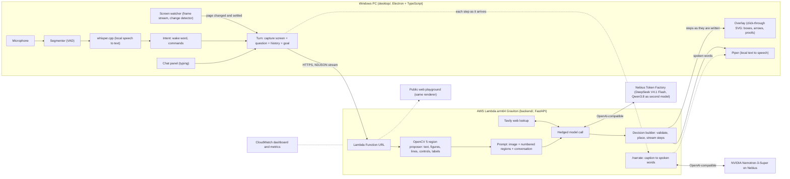

# Sherpa

**An AI agent that sees your screen, knows what you are trying to do, and shows you how.** It draws on whatever you are looking at (arrows, highlights, diagrams, a proof that moves), speaks, and follows the task from page to page by itself. Lost in a cloud console with two hundred services? Say "Hey Sherpa, I need an IAM user for my CLI", and it points at the first menu item, notices when the page changes, and points at the next one. Watching a lecture you cannot follow? It draws the proof on top of the video.

You do not paste a screenshot into a chatbot and hunt for the next click: the guide shares your screen, the answer is a place on the screen, and it is there at the next page.

OpenCV 5 finds what is really on the screen (numbered regions with pixel boxes), a vision model on Nebius Token Factory chooses regions and writes the steps, an NVIDIA Nemotron model turns each step into natural speech, Tavily supplies facts the screen does not hold, and the backend runs on AWS Graviton. The design of the full product (an agent graph with a verifier, MCP tools, retrieval at task time, tenants, a browser extension, an embeddable SDK) is in [`ARCHITECTURE.md`](ARCHITECTURE.md).

**Status:** a working MVP. Voice, chat, drawing, task following, a public web playground and the Graviton backend run end to end; the evaluations are in `backend/evaluation/` (31 single-picture cases and three multi-screen tasks). It can still be wrong, which is why the evaluations, the debug view and the log exist. Open work: `.scratch/screen-tutor/issues/`.

Licence: MIT (`LICENSE`). Notes for the hackathon feedback forms: `FEEDBACK.md`.

## How it works

```
message in the chat panel -> capture screen -> POST /explain-turn/stream (with the conversation) -> backend -> steps -> overlay draws them, the chat writes them
```

- `desktop/`: Electron + TypeScript app. A chat panel in the corner, global hotkeys, screen capture, and a transparent, always-on-top, click-through overlay that paints the canvas as SVG. Both windows are hidden from screen captures.
- `backend/`: Python (FastAPI) service. `explain_turn` takes a capture, a question and the current canvas, and returns the explanation and the new canvas. The model sits behind an adapter; tests use a recorded one.
- Vocabulary (Turn, Capture, Region, Shape, Canvas, Overlay, Explain Turn) is in `CONTEXT.md`.

## Architecture



How the pieces share the work: OpenCV finds what is really on the screen (numbered regions with pixel boxes and line segments); the model only chooses regions by number and writes the teaching, so every drawn shape lands on a real element. **Spoken words.** A caption is written to be read, so the voice would sound like a list. As each step arrives the desktop app asks the backend's `/narrate` for the same step as speech: an NVIDIA Nemotron-3-Super model (through Nebius, reasoning off, about 0.7 s) says what the caption says in natural spoken English, following on from what it said before. It is allowed to rephrase but not to add: a rewrite is dropped, and the caption read instead, if it is slow (2.5 s), fails, runs on, or loses a number of the caption; the model is not told the learner's question, because with it the model started drawing conclusions the screen had not shown. Switch off with `NARRATION=off` (app) or `NARRATION_MODEL=` (backend); other model with `NARRATION_MODEL=`.

The backend is stateless: the desktop app keeps the conversation, the goal, the canvas and the previous regions and sends them with each turn. Following a task is the desktop's job (see `.scratch/screen-tutor/architecture-following.md`).

**Security and failure handling (Agentic Vision).** The backend requires a bearer token and rate-limits per client; both overlay and chat are excluded from screen captures; only the local watcher and voice windows may capture; no audio leaves the computer (speech recognition and synthesis are local); the model output is validated against the contract and an invalid answer is retried once, then reported as an error; a slow model is hedged with a second one after 4 s; a screen that changes mid-turn marks old drawings stale; the loop pauses itself after three off-track answers, 25 automatic turns or 15 idle minutes.

**Task effectiveness:** `backend/evaluation/tasks_report.md` runs the guide loop (question, then an automatic turn at every page change, with goal, conversation and drawings) on three pages of a console: 9 of 9 multi-screen tasks completed with each of the two models, including leading the learner back after a wrong click; with a vaguely worded goal the first run completed only 3 of 9 (the model took a different, valid path), which the report explains.

**Measured on AWS:** Graviton is 22 % cheaper per turn than x86 for the compute part and slightly faster: `backend/evaluation/benchmark.md` (method included, `backend/tools/benchmark.py`).

## Install (one file, two steps)

1. Download `Sherpa-Setup-<version>.exe` and double-click it. It installs for the current user (no admin rights, nothing else to install) and starts the app. (`Sherpa-Portable-<version>.exe` is the same program as a single file with no install.)
2. The first time, the app asks in its chat for your **access token** (paste it, press Enter; it is kept in `%APPDATA%\sherpa\.env` and asked for only once) and downloads the speech models by itself (about 200 MB, with a progress line in the chat; you can already type while it does). Then say "Hey Sherpa, ..." or press Ctrl+Shift+E.

The backend address is built into the download; the access token is never part of it (it is a secret: whoever has it can spend the backend's model budget). Not code-signed, so Windows SmartScreen may say "unknown publisher": More info, Run anyway.

Building the files yourself: `cd desktop; npm install; npm run package -- --url=https://<your function url>.on.aws` writes both files to `desktop/release/`. Tested here on a clean set of data folders: the installer's program starts, downloads the voice models by itself and starts listening without a restart.

## Deploy and measure on AWS

`infra/README.md`: `cd infra; npx cdk deploy` deploys the backend as an arm64 Lambda container with a streaming Function URL and a CloudWatch dashboard. `npx cdk deploy ScreenTutorBenchmark -c benchmark=true` creates the arm64 and x86 pair for the benchmark (destroy it afterwards with `cdk destroy`).

## Requirements

Windows 10 (2004+) or 11, Node.js 22+, Python 3.11+.

## How it feels

The chat panel opens in the corner (Ctrl+Shift+E shows and hides it). Type a message and press Enter: the screen is captured at that moment, the detected regions flash across it (you see it reading), and as soon as the first step is written a cursor glides to the first spot, the drawing is drawn on stroke by stroke and the step is typed into the chat. Later steps arrive while it draws and play on by themselves; pause, step back and forward from the panel or with Ctrl+Shift+, and Ctrl+Shift+. . Click a step in the chat to see it again.

It is a real conversation: ask the next thing without any hotkey, or use the suggested replies under the answer ("Done, what next?"). New chat (the button, or Ctrl+Shift+N) forgets the conversation and the drawings; Clear (Ctrl+Shift+X) only takes the drawings off. Pointing marks (boxes, arrows) go away by themselves when the next step draws something; squares and formulas build up.

It can also follow a task by itself: when you are doing something over several pages ("create an access key"), the tutor states the goal, the chat shows it with a Following switch, and the app watches the screen. When a click changes the page the old marks fade away at once; once the new page has settled the tutor gives the next step with no message from you, says plainly if you went the wrong way, and says when you are done. Ways to stop: the **Following** switch pauses the automatic steps (the goal stays), **End task** or Ctrl+Shift+S ends the task, the Stop button cancels an answer being fetched (and pauses following so it does not start again by itself), New chat forgets everything, and following pauses by itself after 15 minutes without any activity. Moving the mouse is ignored (a box around the pointer is left out of the comparison).

**Voice.** The first time the app starts it downloads a small speech recogniser and a voice (about 200 MB, to `%LOCALAPPDATA%\sherpa`; both run on your computer, no audio leaves it); from a terminal the same download is `npm run setup:voice` in `desktop/`. Then the app is voice first: a small orb at the bottom left listens. The wake word is **Sherpa** ("Nova" works too); change it with `WAKE_WORD=...` in `.env` (comma separated, the first one names it in the hints, for example `WAKE_WORD=jarvis,sherpa`). Say "Hey Sherpa, ..." and ask; the answer is drawn on the screen and read aloud step by step. While it is working on a task you can say "done", "what is next", "I don't see it" or "stop" without the wake word, and for 12 seconds after it speaks you can just answer it. To type, say "open chat" (the chat is hidden by default); "close chat" puts it away. Other phrases: "new chat", "pause", "resume", "next step", "go back", "clear the marks", "say that again", "be quiet", "talk to me", "mute". The same script also downloads the voice that talks (Piper, a neural voice that runs on your computer; default `en_US-lessac-medium`; another one with `PIPER_VOICE=en_US-ryan-high` in `.env`, downloaded at the next start) and it speaks 1.2 times faster than normal (`SPEECH_RATE=1.2` in `.env`; 1 is normal). Without it the Windows voices are used. English only. Without the recogniser installed the app works as before, with the chat. If the orb says it cannot hear you: it explains why (usually Windows' Settings, Privacy & security, Microphone, "Let desktop apps access your microphone"), looks for another microphone by itself, and a click on the orb tries again; what it heard is shown on the orb, so a missing wake word is easy to see.

Two ways it helps: **teaching** (explain why something is true, with a proof you can watch) and **guiding** (find where to click in an unfamiliar app or cloud console, one action per step, only pointing at what is on screen). The web playground at `/` (served by the backend) offers both with samples and no install.

## Pieces

- `desktop/`: the Windows app (Electron).
- `backend/`: the Explain Turn service (Python, FastAPI, OpenCV 5). Also serves the public web playground at `/`.
- `backend/evaluation/`: 31 labelled cases and `python -m evaluation.run --models a,b` (report in `backend/evaluation/report.md`).
- `infra/`: AWS CDK for the backend as an arm64 (Graviton) Lambda container. See `infra/README.md`.

To use the deployed backend from the desktop app, set `EXPLAIN_BACKEND_URL` to its address and `BACKEND_ACCESS_TOKEN` in `.env`.

## Run it

Backend (terminal 1):

```powershell
cd backend
py -3.11 -m venv .venv
.\.venv\Scripts\python.exe -m pip install -e ".[dev]"
.\.venv\Scripts\python.exe -m uvicorn app.server:app --port 8000
```

Desktop app (terminal 2):

```powershell
cd desktop
npm install
node node_modules/electron/install.js   # only if npm skipped the Electron download
npm start
```

Hotkeys:

| Keys | Action |
|---|---|
| Ctrl+Shift+E | Show or hide the chat panel (it keeps the conversation) |
| Ctrl+Shift+N | New chat: forget the conversation and the drawings |
| Ctrl+Shift+M | Mute or unmute the microphone (voice) |
| Ctrl+Shift+Space | Talk now: the next thing you say is for the tutor, whatever it starts with (voice) |
| Ctrl+Shift+. | Next step of an explanation (Ctrl+> on a US keyboard) |
| Ctrl+Shift+, | Previous step |
| Ctrl+Shift+X | Take the drawings off the screen (the chat stays) |
| Ctrl+Shift+S | Stop: cancel the answer being fetched, end the task being followed (the End task button does the same), take the marks off |
| Ctrl+Shift+R | Recording mode: the tutor's windows can be seen by a screen recorder (OBS, Game Bar), for a demo video; press again to switch off. `RECORDING=1` starts in it |
| Ctrl+Shift+D | Toggle the debug view: draws every detected region with its number on the last capture |
| Ctrl+Shift+Q | Quit |

Settings come from environment variables or a local `.env` (copy `.env.example`; `.env` is git-ignored). The backend reads `.env` once when it starts: after editing it, stop the backend (Ctrl+C) and start it again. `MODEL_ADAPTER=fake` gives a canned answer with no network; `MODEL_ADAPTER=nebius` calls the real model (needs `NEBIUS_API_KEY`; `MODEL_NAME` picks the model, default `deepseek-ai/DeepSeek-V4.1-Flash`).

Try the real model on any image without the desktop app:

```powershell
cd backend
.\.venv\Scripts\python.exe toolssk_model.py my-screenshot.png "What is x in the triangle?" out.png
```

## Recording a demo video

The overlay, the chat and the orb are hidden from screen captures on purpose (the AI must never see its own drawings), so a recorder such as OBS or the Windows Game Bar shows a screen without them. Press **Ctrl+Shift+R** (or start with `RECORDING=1`) to switch on recording mode: the windows become visible to recorders. While it is on, the capture sent to the model is taken with the tutor's windows made invisible for that moment (a short blink at each question, so the model still does not see its own marks), and the screen watcher stops comparing while the overlay draws and measures again from the finished picture, so it does not take the drawing for a page change; the panel and the orb are left out of the comparison. A page change in the first second or so after a drawing starts is not noticed in this mode. Press Ctrl+Shift+R again to go back to normal.

## Tests

```powershell
cd backend; .\.venv\Scripts\python.exe -m pytest      # seam 1: Explain Turn
cd desktop; npm test                                  # seam 2: overlay renderer
cd desktop; npm run typecheck
```

Not covered by automated tests (check by hand): screen capture, global hotkeys, click-through, and that the overlay does not appear in captures.

## Look at what the region proposer finds

```powershell
cd backend
.\.venv\Scripts\python.exe tools\draw_regions.py lecture out.png      # fixtures: lecture, lecture_changed, app
.\.venv\Scripts\python.exe tools\draw_regions.py my-screenshot.png out.png
```

It saves the image with every numbered region drawn on it and prints the list. `MAX_REGIONS` (default 70) caps the count. Lines of text are separate regions unless packed like a paragraph, so a menu item or a list row can be pointed at.

## Manual smoke test

1. Start the backend and the desktop app as above.
2. The chat panel opens in the bottom right corner. Type a question about what is on screen and press Enter. With `MODEL_ADAPTER=fake` a red box labelled "Walking skeleton" appears; with `nebius` the model draws and explains (about 3 to 8 seconds).
   Try "Explain why the Pythagorean theorem is true" on a video with a right triangle: a proof diagram appears beside it and the four triangles slide into their new places. Move through the steps with the panel buttons or Ctrl+Shift+. and Ctrl+Shift+,.
   Then type a follow-up (no hotkey needed): the conversation and the drawing carry on.
   Try the guide: open a page you find confusing and ask "I am lost, where do I click to ...?".
3. Click through the box onto the window underneath: the click must reach that window.
4. Press Ctrl+Shift+X: the drawings disappear (the chat stays). Press Ctrl+Shift+N: the chat starts empty.
5. Stop the backend and send a message: the chat says the backend cannot be reached.
6. With the backend running, send a message, then press Ctrl+Shift+D: numbered, coloured boxes appear over the text blocks, figures and controls on your screen (blue text, green figure, red control). Press Ctrl+Shift+D again to hide them.
