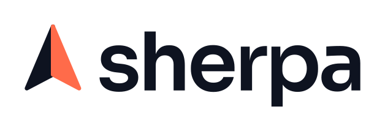
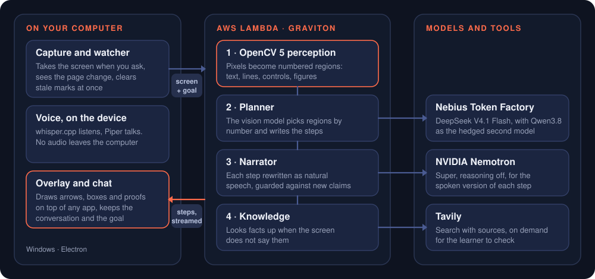
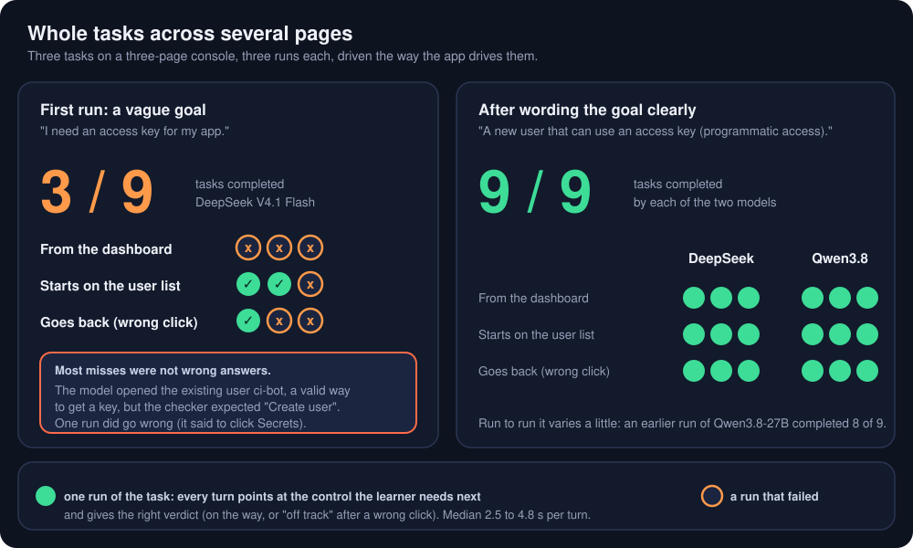
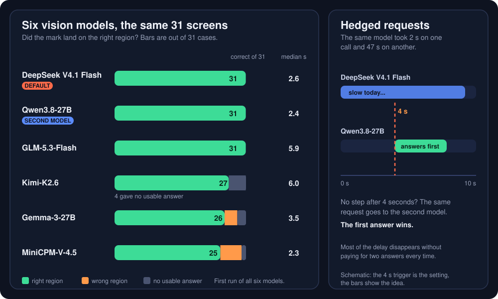
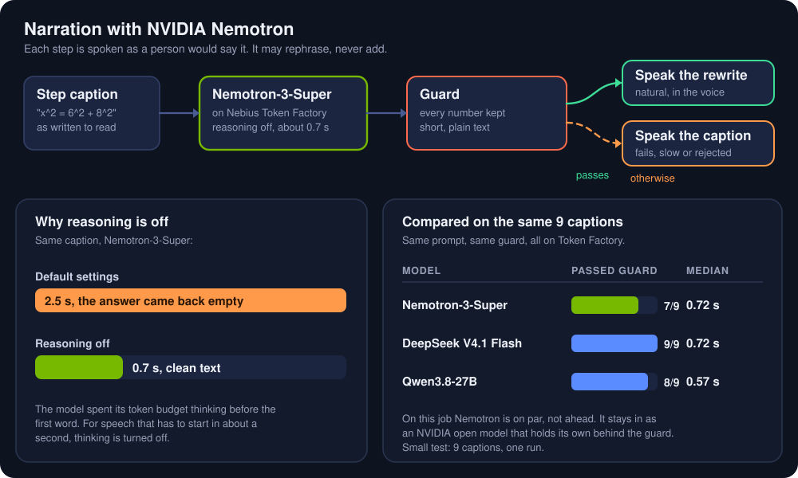
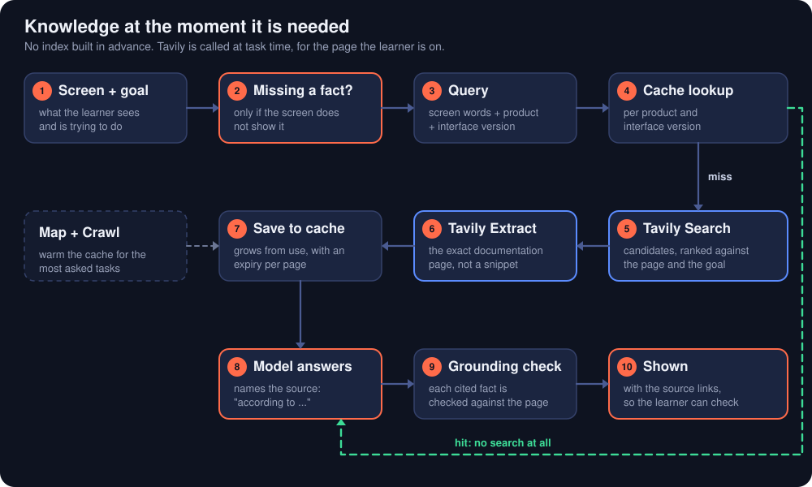

<h1 align="center">
  <picture>
    <source media="(prefers-color-scheme: dark)" srcset="docs/img/sherpa-logo-on-dark.svg">
    
  </picture>
</h1>

<h3 align="center">Stop reading instructions. Start following the arrow.</h3>

**Sherpa is an AI guide that lives on top of your screen.** It sees exactly what you see, points at what to do next, and stays with you from the first click to the last, in any app, on any page.

<p align="center"></p>

## The problem

Software keeps getting bigger, and nobody gets a map. A cloud console has hundreds of services. An internal tool has a menu for every team that ever shipped a feature. A tax form, a design app, a lecture video with a proof you cannot follow: the answer exists, and you are still lost.

AI made the *what* easy. Ask any chatbot and you get correct steps. But software is **spatial** and the answer is **text**. "Open the Users page and choose Create access key" tells you nothing about *where*, on *this* page, with *this* layout, in *this* version, with the menu named slightly differently from the guide.

So everyone runs the same loop. Ask in one tab. Switch to the app. Screenshot. Paste. Read. Translate words back into a place on the screen. Click. The page changes. Start again. Every lap costs minutes and a context switch, and the advice never sees the page you are actually on, so it is wrong in small ways that cost a lot: the wrong permission on a production account, the wrong plan on a checkout page, a setup abandoned half way.

New hires, developers in unfamiliar consoles, customers on a form, students with a proof: the people who feel it most are the ones with the least time to learn a new interface. And the teams behind the software answer the same "where do I click" question, over and over.

## How Sherpa solves it

Sherpa removes the loop. There is nothing to open, paste or translate.

- **It is already there.** Sherpa floats above whatever you are doing. Call it with your voice or a hotkey and it appears on the page you are on: no new tab, no screenshot, no copy and paste, no integration with the app. It works on software it has never seen.
- **It sees what you see, right now.** Computer vision (OpenCV 5) turns the live screen into numbered, real elements, so the guide knows what is on this page and where.
- **It shows instead of tells.** A box on the exact button, an arrow, a highlighted line, a diagram, a proof that moves. The answer is a place on your screen, with one sentence on why.
- **It stays with you.** Say what you want to get done once. When you click and the page changes, the old marks vanish and the next step appears, until the task is done. You never ask twice.
- **It explains, not just directs.** It tells you why a step matters (why a permission matters, why a key is shown only once), so you leave knowing the interface, not just one path through it.
- **It guides; you act.** Sherpa never clicks, types or changes anything for you. You stay in control, nothing can go wrong because of it, and you learn the interface you will use again tomorrow. Agents that click for you already exist. This is the other half.
- **It talks.** Say "Hey Sherpa" and ask. Speech recognition and the voice run on your computer: no audio leaves it.

## See it work

### Guided through the AWS console

*"Create an IAM user for my Claude Code." Sherpa boxes the search bar, then each menu, each field and each option as the pages change, warns that the key is shown only once, and says when the task is done.*

https://github.com/user-attachments/assets/c5be13bd-957f-4119-a761-8332bd14316e

### A proof, drawn on the video

*A right triangle on screen and a question: can you solve it? Sherpa labels the sides, works it out, then shows why the theorem is true: four triangles slide into place on top of the picture.*

https://github.com/user-attachments/assets/a464b8ba-48f6-46a9-bfaf-8885a80e07c5

## Try it

**In the browser, nothing to install:** the [web playground](https://yz6et5qn3u2w247zc2rcndjxqa0tcgso.lambda-url.us-east-1.on.aws/) has sample screens, a made-up cloud console and a three-page task.

**On Windows, two steps:**

1. Download **Sherpa-Setup** from the [latest release](https://github.com/hungtruongOwolf/sherpa/releases/latest) and open it (a portable single file is there too). It installs for your user, no admin rights.
2. The first start downloads the speech models (about 200 MB, once). When the chat says the voice is ready, say **"Hey Sherpa, I need to create an IAM user. Where do I start?"** with a cloud console open, or press Ctrl+Shift+E to type.

The app is not code-signed, so Windows may say "unknown publisher": choose More info, then Run anyway.

## How it works

<p align="center"></p>

1. **OpenCV 5 finds what is on the screen.** Text lines, lines of a drawing, controls, labels, figures and pictures become numbered regions with pixel boxes.
2. **The vision model chooses, it does not guess.** It picks regions by number and writes the steps, so every mark lands on a real element and never at an invented coordinate.
3. **Each step is drawn and said.** Captions and arrows are placed clear of text, animated, and rewritten as natural speech.
4. **The watcher keeps the thread.** The client keeps the goal and the conversation, watches the screen, clears stale marks the moment the page changes, and starts the next step when the page has settled. The backend is stateless.

## What we measured

| | Result | Report |
|---|---|---|
| Pointing at the right region, 31 labelled cases, six models | The default model points correctly on all 31; the second model on 30 or 31 | [`backend/evaluation/report.md`](backend/evaluation/report.md) |
| Whole tasks over several pages, driven like the app drives them | 9 of 9 tasks completed with each of the two models, including leading the learner back after a wrong click | [`backend/evaluation/tasks_report.md`](backend/evaluation/tasks_report.md) |
| Graviton against x86 for the backend | About 22 % cheaper per turn, slightly faster | [`backend/evaluation/benchmark.md`](backend/evaluation/benchmark.md) |

<p align="center"></p>

## Nebius Token Factory and NVIDIA Nemotron

**Where Token Factory sped the work up.** One OpenAI-compatible API meant that switching a model is changing a string. In one afternoon we ran the same 31 labelled screens through six vision models (DeepSeek V4.1 Flash, Qwen3.8-27B, Kimi K2.6, GLM 5.3 Flash, Gemma 3 27B, MiniCPM-V 4.5) and chose by evidence: DeepSeek V4.1 Flash is the default and Qwen3.8-27B is the second model. Latency of one model varied from 2 s to 47 s, so the backend hedges: if the main model has not produced a step in 4 seconds, the same request goes to the second model and the first answer wins. Responses stream, so the first step is drawn while the rest is still being written. Code: `backend/app/openai_adapter.py`, `backend/app/hedging.py`.

<p align="center"></p>

**Where NVIDIA Nemotron is used.** `nvidia/nemotron-3-super-120b-a12b`, served on Token Factory, rewrites each step's caption as natural speech in under a second with reasoning switched off (with defaults it spent its tokens thinking and returned nothing). The rewrite may rephrase but never add: a guard drops it if it loses a number of the caption, runs on, or contains markup, and the caption is read instead. Code: `backend/app/narration.py`, tests in `backend/tests/test_narration.py`. The vision turn runs on DeepSeek and Qwen; an NVIDIA vision model on a dedicated endpoint is the next comparison.

<p align="center"></p>

**Other services.** Tavily search on the model's request, with sources shown; AWS Lambda on Graviton with a streaming Function URL.

## Tavily: knowledge at the moment it is needed

<p align="center"></p>

A screen shows what a page *says*, not what it *means*, and a documentation index built in advance goes stale the day a console changes its layout. So Sherpa carries no knowledge base: it calls Tavily at task time, for the page the learner is on.

- **Queries come from the screen:** its own words plus the product and interface version, so a search for "Create access key" does not return another vendor's page.
- **The page, not the snippet:** Tavily Extract fetches the exact documentation page, and the answer names it.
- **A cache that grows from use:** pages are kept per product and interface version with an expiry; a changed page misses the cache and is fetched again.
- **Grounding check:** a step that cites a fact is compared with the page before it is shown.
- **Crawl and "what changed":** Map and Crawl warm the cache for the most asked tasks, and a screen that no longer matches the cache triggers a search for what changed.
- **Never breaks a turn:** if Tavily fails, Sherpa says it could not check a source; retrieval runs one round per turn.

## Run it yourself

```powershell
# backend (Python 3.11+)
cd backend
py -3.11 -m venv .venv
.\.venv\Scripts\python.exe -m pip install -e ".[dev]"
# put NEBIUS_API_KEY in a .env at the repository root, with MODEL_ADAPTER=nebius (copy .env.example)
.\.venv\Scripts\python.exe -m uvicorn app.server:app --port 8000

# desktop app (Node 22+, Windows)
cd desktop
npm install
npm start          # EXPLAIN_BACKEND_URL defaults to http://127.0.0.1:8000
```

`MODEL_ADAPTER=fake` runs the whole flow with a canned answer and no keys. Tests: `python -m pytest` in `backend`, `npm test` in `desktop`. More in [`docs/development.md`](docs/development.md).

## Built with

- **OpenCV 5**: the perception layer. Contours and text-line merging for regions, a Hough transform and closed-shape tracing for the sides of a drawing, texture statistics for pictures and free space, and a block-based change detector on a live frame stream. Code: `backend/app/regions.py`, `desktop/src/follow/`.
- **Nebius Token Factory**: the vision turns. DeepSeek V4.1 Flash as the default and Qwen3.8 as a second model asked when the first is slow (hedged requests), compared with four other models on the same cases.
- **NVIDIA Nemotron**: Nemotron-3-Super turns each step into natural speech, with reasoning off, and every rewrite is checked so it cannot lose a number or add a claim. Code: `backend/app/narration.py`.
- **Tavily**: when the screen does not hold a fact, the model asks for a web search and the answer shows its sources.
- **AWS Graviton**: the backend is a container on Lambda arm64 behind a streaming Function URL, with CloudWatch metrics and a CDK definition in `infra/`.

## Where it is going

Sherpa is built for any software, not for one subject: onboarding in enterprise tools, customer support with a shared screen, training from a recorded expert walkthrough, accessibility, and other agents that need eyes. The full design (agent graph, verifier, MCP tools, retrieval at task time, tenants, a browser extension and an SDK) is in [`ARCHITECTURE.md`](ARCHITECTURE.md).

## Documentation

- [`docs/usage.md`](docs/usage.md): keys, voice, following a task, recording a demo
- [`docs/development.md`](docs/development.md): run from source, tests, building the installer, deploying
- [`ARCHITECTURE.md`](ARCHITECTURE.md): the design of the full product
- [`docs/feedback.md`](docs/feedback.md): notes on the platforms we used
- [`infra/README.md`](infra/README.md): the AWS deployment

Licence: MIT ([`LICENSE`](LICENSE)).
