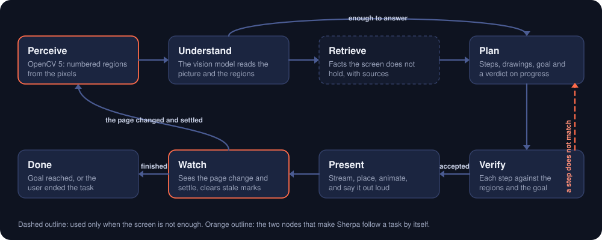
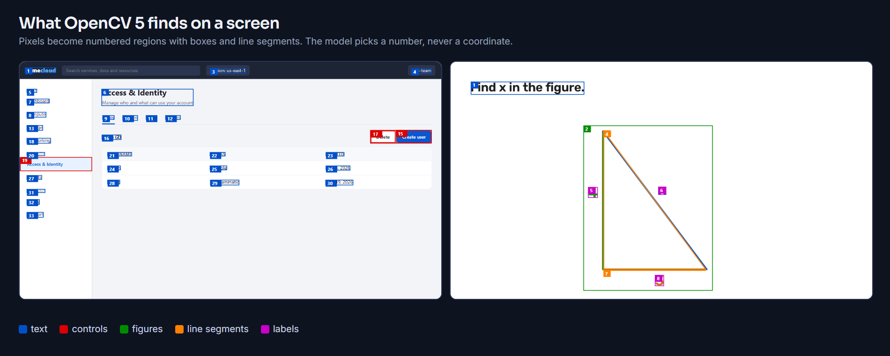
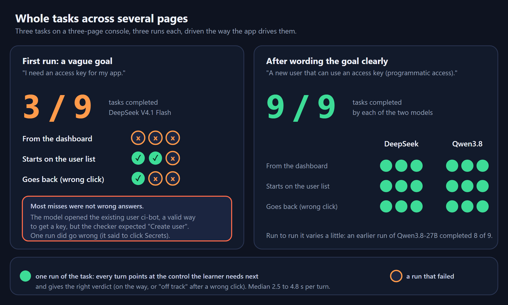
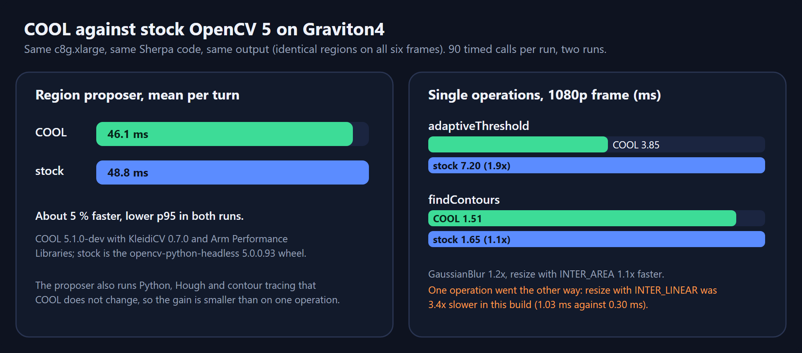
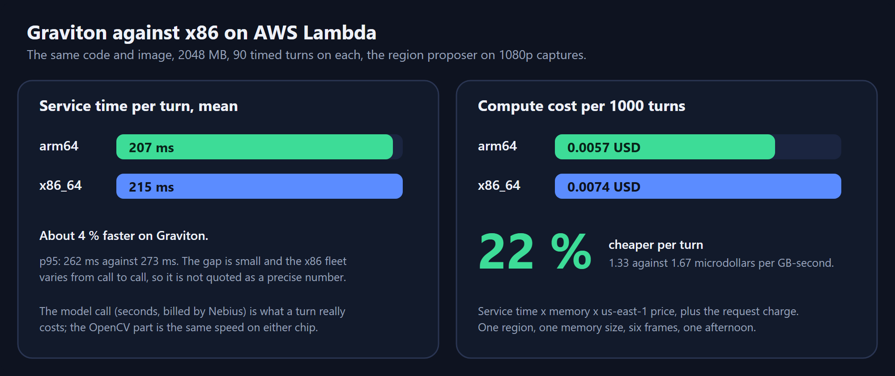

# Sherpa: technical report

An AI agent that sees what you see. It looks at the screen, points, draws and explains on top of it, and follows a task across pages. Windows desktop app (Electron) and a Python backend on AWS Lambda (Graviton, arm64) that runs OpenCV 5.

Repository: https://github.com/hungtruongOwolf/sherpa

## 1. Problem and users

Anyone who meets an unfamiliar screen: a newcomer in a cloud console, someone configuring an internal tool, a student watching a lecture with a proof they cannot follow. A chat assistant gives correct steps, but the user must translate "choose Create access key on the Users page" into a place on *their* screen, switch tabs, paste screenshots, and start again after every click. The *what* became cheap; the *where* is still on the user.

Sherpa answers on the screen itself: a box on the right control, an arrow, a highlighted line, a drawing that explains an idea, one sentence of why, spoken aloud. It stays with the user until the task is done and **never clicks or types for them**.

## 2. Architecture


- **Desktop app (Electron, TypeScript).** Captures the screen on request, shows a click-through overlay and a chat panel (both hidden from screen capture), listens for the wake word (whisper.cpp) and speaks (Piper), both on the user's machine. A hidden window reads the screen as a stream for the change detector.
- **Backend (Python 3.11, FastAPI) on AWS Lambda.** One stateless service, `POST /explain-turn/stream` (newline-delimited JSON events), reached through a Lambda Function URL with response streaming (AWS Lambda Web Adapter). Perception is OpenCV 5; reasoning is a vision model on Nebius Token Factory (DeepSeek V4.1 Flash, with Qwen3.8-27B as a hedged second model); narration uses NVIDIA Nemotron; Tavily is available for lookups.
- **Contract.** The request carries the JPEG capture, the question, the conversation, the goal and the regions of the previous capture. The response is a stream of steps, each a list of drawing operations anchored to **region ids**, plus a verdict on progress.

Agent graph (perception, decision, action):



## 3. OpenCV 5 implementation

OpenCV 5 (`opencv-python-headless==5.0.0.93`) is the first stage of every turn. The model never invents coordinates: it picks a region by number, so every mark lands on something OpenCV found.



`backend/app/regions.py` (`propose_regions`) produces, in about 207 ms warm on a 1920 x 1080 capture:

| Region kind | How it is found |
|---|---|
| text lines | grayscale and adaptive threshold, morphology to join letters into words and lines, connected components, filtered by size and aspect |
| controls | edges and contours for rectangles with fills or borders (buttons, tabs, fields, menu rows) |
| figures | drawings detected by their line density and closed shapes |
| line segments | Hough transform inside figures, with end points and orientation; short broken lines are merged |
| closed shapes | contour tracing that survives JPEG breaks (a hand-drawn triangle on a lecture video becomes a figure) |
| labels | small ink marks near a line (the "4", the "x") |
| image regions | texture statistics (a photo or video area is not text) |
| hidden kinds | an occupancy map ("detail": free space) and "ink" marks, never shown, used by the placer |

The marked image sent to the model carries the numbers and geometry hints computed by OpenCV (line orientation, the nearest line for each label). A **placer** (`desktop/src/render/place.ts`) scores positions for captions and arrow tails against the regions, with hard obstacles (text, controls) and soft ones (hidden kinds), so a label does not land on the digit it names.

A second use of OpenCV output: each region carries a 64-bit perceptual hash of its pixels. The next turn receives the previous turn's regions, so the backend can tell whether the content under a drawn shape is still the same without keeping any image.

The **change detector** that follows a task is client code (TypeScript, `desktop/src/follow/changeDetector.ts`): averaged frames, a block comparison, a mask for areas that always move, the pointer and Sherpa's own windows left out. Measured in the real app: marks go stale in about 0.1 s, typing is noticed in about 1.2 s, a page change in about 0.8 s.

## 4. AWS deployment

CDK stack `Sherpa` (`infra/lib/sherpa-stack.ts`), us-east-1:

| | |
|---|---|
| Compute | Lambda container image, **arm64 (Graviton)**, 2048 MB, 120 s timeout |
| Base image | `python:3.11-slim` with AWS Lambda Web Adapter 0.9.1; the same FastAPI app runs locally and in Lambda |
| Entry | Function URL with response streaming (`RESPONSE_STREAM`) so steps reach the overlay while the model is still writing |
| Protection | access token and a per-minute rate limit in the service; the app logs timings, never images, tokens or text |
| Observability | CloudWatch log group, custom metrics (namespace `Sherpa`) and a dashboard |
| Benchmark | stack `SherpaBenchmark`: an arm64 and an x86_64 function from the same code, destroyed after use |

The code builds for `linux/arm64` and `linux/amd64` from one Dockerfile; moving between them is a one-line change in the stack.

## 5. Evaluation

Full results are in `backend/evaluation/`.

**Region choice** (`report.md`): 31 labelled screens (triangles in four orientations and two themes, toolbars, bullet slides) through six vision models on Nebius Token Factory. The mark landed on the right region 31/31 for DeepSeek V4.1 Flash, Qwen3.8-27B and GLM 5.3 Flash; 27/27 answered for Kimi K2.6 (4 gave no usable answer); 26/29 for Gemma 3 27B; 25/30 for MiniCPM-V 4.5. The cases are synthetic and easy: they separate weak from strong models.

**Whole tasks** (`tasks_report.md`): three tasks on a three-page console, three runs each, driven the way the app drives them; a task succeeds when every turn points at the control the learner needs next and gives the expected verdict.



With a vaguely worded goal the first run completed 3 of 9. Most misses were valid alternatives the fixed checker did not accept (opening the existing user instead of creating one), and one run was plainly wrong. With the goal worded clearly, both models completed 9 of 9 (an earlier run of Qwen3.8-27B completed 8 of 9).

**Decision trace** (`trace.md`, `tools/trace.py`): for each turn, what OpenCV found on the new screen, how many of the previous screen's regions are still there, which region the answer points at and the verdict. In the trace, the dashboard page yields a control region for the "Access & Identity" menu row and the agent points at it; after the click the OpenCV output of the new screen contains the "Create user" button as a control region and the next decision points at that region; in the wrong-way scenario the new screen's regions are the dashboard's again (the "Access & Identity" menu row is back as a region), the agent answers `off_track` and points back at that row.

**Graviton against x86** (`benchmark.md`): see the next section.

### COOL evidence



- **COOL version and deployment:** AWS Marketplace "Cloud Optimized OpenCV For AWS Graviton4" (AMI `ami-033e481a24f94c8cb`, Python 3.12 environment under `/opt/cool`), on a `c8g.xlarge` EC2 instance (Graviton4, Neoverse-V2, 4 vCPU, Ubuntu 24.04), us-east-1. `cv2.__version__` reports `5.1.0-dev`, built with `-O3 -mcpu=neoverse-v2`, KleidiCV 0.7.0, Arm Performance Libraries 25.07.1.
- **Evidence that COOL runs the core workload:** the benchmark imports the unchanged Sherpa region proposer (`app.regions.propose_regions`, every OpenCV pass described in section 3) under the COOL interpreter; the instance's `cv2` resolves to `/opt/cool/python_3.12/site-packages/cv2`, and `cv2.getBuildInformation()` lists KleidiCV and ARMPL as the custom HAL (`evaluation/cool.md`).
- **Method:** the six sample screens scaled to 1920 x 1080 and JPEG-encoded the way the app sends them; one warm-up round and 90 timed calls per run, two runs, alternating COOL and stock; `tools/cool_bench.py`.
- **Baseline:** the standard `opencv-python-headless==5.0.0.93` wheel on the same instance with the same code. Both builds find identical regions on all six frames.
- **Results:** region proposer mean 46.1 ms with COOL against 48.8 ms stock (about 5 % faster, lower p95 in both runs); `adaptiveThreshold` 1.9x faster, `GaussianBlur` 1.2x, `findContours` 1.1x, `resize` with INTER_AREA 1.1x; `resize` with INTER_LINEAR was 3.4x slower in this build.
- **Architecture:** hybrid. The Lambda function (arm64) runs the same code with the stock wheel, because COOL ships as an AMI; the COOL path is an EC2 Graviton4 instance running the same backend. Lambda arm64 against x86_64 (stock OpenCV, 90 turns each) measured 207 ms against 215 ms and 22 % lower compute cost per 1000 turns (`benchmark.md`).



### Agentic Vision evidence

- **Workflow:** perception (OpenCV regions, watcher) → decision (the model picks regions, writes steps, gives a verdict against the goal) → action (marks, drawings and speech on the overlay; the user performs the click) → the page changes → perception again.
- **OpenCV output changes a later decision:** `trace.md`, as above.
- **Failure handling:** a retry for a dropped connection or a 5xx before any step; a hedged second model after 4 s; an error after steps were shown is reported and following is re-armed; a page change during a running turn is remembered and handled when the turn ends; narration or lookup failure falls back to the caption; following pauses after three off-track answers, after 25 automatic turns or after 15 idle minutes.
- **Observability:** the app writes `%APPDATA%\sherpa\logs\app.log` (turn start and end with timings, capture size, errors with stack, watcher events; no images, tokens or text); the backend returns per-stage timings in every response and publishes CloudWatch metrics.
- **Human control:** Sherpa guides, you act. An End task button, a stop-everything hotkey, a mute hotkey, and the learner's own click is the only action ever taken.

## 6. Limitations

- The task evaluation is three pages of a made-up console, nine runs per model: it shows the loop works end to end, not how it does on every real site. A real, heavy single-page console (AWS IAM) has shown choppy following in our own testing, and the cause is not yet isolated.
- The `done` verdict is not covered by the task evaluation (the mock has no confirmation page).
- The region-pick cases are synthetic and easy.
- The change detector can fail to settle on pages with constant motion (video, animation) and may count hover effects far from the pointer as a small change.
- Wrong goal wording can lead the agent down a valid but unexpected path; the chat shows the goal so the user can correct it.
- Windows only; English only; speech recognition depends on the microphone and the room.
- Region proposal on dense or unusual interfaces (custom-drawn controls, tiny icons) is heuristic; learned detectors, text recognition with OpenCV's DNN module, feature matching for icons and homography re-anchoring are not implemented.
- Benchmarks: one region, one instance size, six frames, one afternoon. The COOL gain on the whole proposer is about 5 % (larger on single operations, negative on one) and the Lambda speed gap is small; neither should be quoted as precise. The deployed Lambda runs stock OpenCV; COOL was measured on EC2.
- Model quality and latency vary from call to call (the same model took 2 s on one call and 47 s on another).

## 7. Responsible use

- **The user stays in control.** Sherpa never clicks, types or changes anything; it points and explains.
- **Privacy.** Only the screen the user asks about (or follows, after asking) is sent; the overlay and chat windows are hidden from the capture; the backend is stateless and stores no images; logs contain timings, not content; speech recognition and the voice run on the device. Microphone and screen are used only after the user starts a task.
- **Sensitive screens.** The user decides what is on screen when they ask. The follow mode can be ended at any time and pauses by itself when idle.
- **Honesty.** Answers can be wrong; the learner sees the evidence (the box on the control, the caption, the shown goal) and can check it. Sources are shown when a lookup is used.
- **Access.** The cloud backend requires a token and is rate limited, so a leaked URL cannot be used freely.

## 8. Build, deploy and test

Everything is in `docs/development.md` and `infra/README.md`. In short:

```powershell
# backend (Python 3.11)
cd backend
py -3.11 -m venv .venv
.\.venv\Scripts\python.exe -m pip install -r requirements.lock
.\.venv\Scripts\python.exe -m pip install --no-deps -e .
.\.venv\Scripts\python.exe -m pytest

# desktop (Node 22)
cd ..\desktop
npm ci
npm test

# AWS
cd ..\infra
npm ci
npx cdk deploy
```

Dependencies are pinned in `backend/requirements.lock` (OpenCV 5.0.0.93, FastAPI 0.142.2, NumPy 2.4.6 and the rest) and `desktop/package-lock.json`. Evaluation, trace and benchmark commands are listed in `docs/development.md` under "Reproduce the evaluation".
